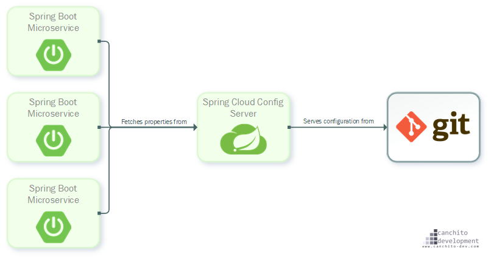

#Distribution Configuration Management

A microservice-based applications managing configuration settings for each service is difficultly.
For the above, you can use spring cloud config server using Git repository configuration storage.

###Architect




First step,
You have to add @EnableConfigServer annotation in MainClass(ConfigServiceApplication).
In order to create config service, you have to add spring-cloud-config-server and spring-boot-starter-security dependencies in pom.xml.

You can create bootstrap.yml file in resource, then write the following in the bootstrap.yml.

``` 
spring:
  application:
    name: config-service
environment: dev
encrypt:
  key: ENCRYPT
---

spring:
  profiles: dev
  cloud:
    config:
      server:
        git:
          uri: ${HOME}/configuration-poc/configurations
          searchPaths:
            - "{application}/${environment}"
          clone-on-start: false
          basedir: /tmp/tmp-git/
          strict-host-key-checking: false
        prefix: /configs/
server:
  port: 8888
environment: dev 
```

You can create different configuration for each environment.


